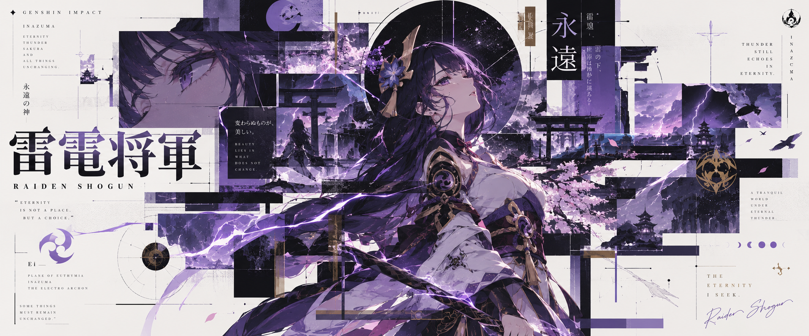
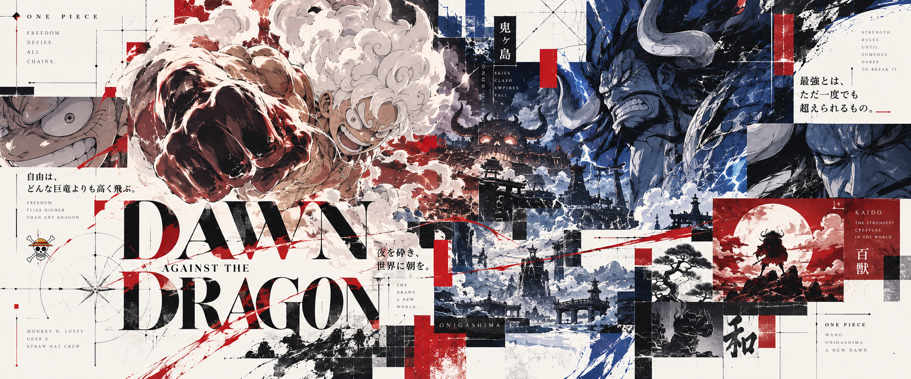

# Collage Poster

[English](./README.md)

一个用于 Codex 的实验性宣传海报生成 Skill。

项目采用 **日本当代平面设计 × 瑞士编辑排版 × 解构主义拼贴** 的视觉风格，可用于生成动漫、游戏、体育赛事、影视角色等主题的宣传海报。

## 使用方法

将仓库克隆到 Codex 的 Skills 目录：

```bash
git clone <YOUR_REPOSITORY_URL> ~/.codex/skills/collage-poster
```

随后即可在 Codex 中直接使用：

```text
使用 $collage-poster 为《原神》的雷电将军生成一张宣传海报。
```

也可以直接描述需要生成的主题，并补充配色、文字、氛围、构图等要求。

## 示例

### 雷电将军 · 原神



### 北京国安 vs 山东鲁能


### 路飞 vs 凯多 · 海贼王

