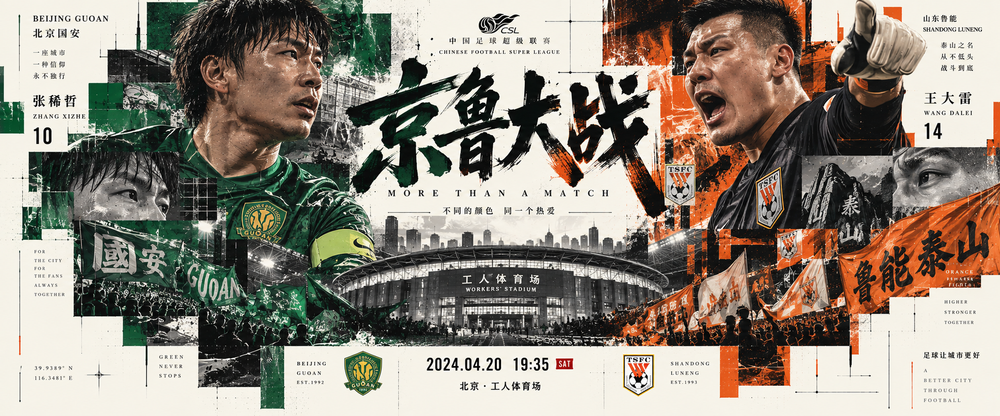

# Collage Poster

[中文](./README-zh-cn.md)

A Codex Skill for generating experimental promotional posters with a dense editorial collage style.

It combines **Japanese contemporary graphic design, Swiss editorial typography, and deconstructed collage**, and can be used for character posters, sports posters, games, anime, movies, and other promotional visuals.

## Usage

Clone this repository into your Codex Skills directory:

```bash
git clone https://github.com/JaxonHello/collage-poster.git ~/.codex/skills/collage-poster
```

Then use the Skill directly in Codex:

```text
Use $collage-poster to create a promotional poster for Raiden Shogun from Genshin Impact.
```

You can also simply describe the subject and any additional requirements such as colors, text, mood, or composition.

## Examples

### Raiden Shogun — Genshin Impact


### Beijing Guoan vs Shandong Luneng



### Luffy vs Kaido — One Piece


